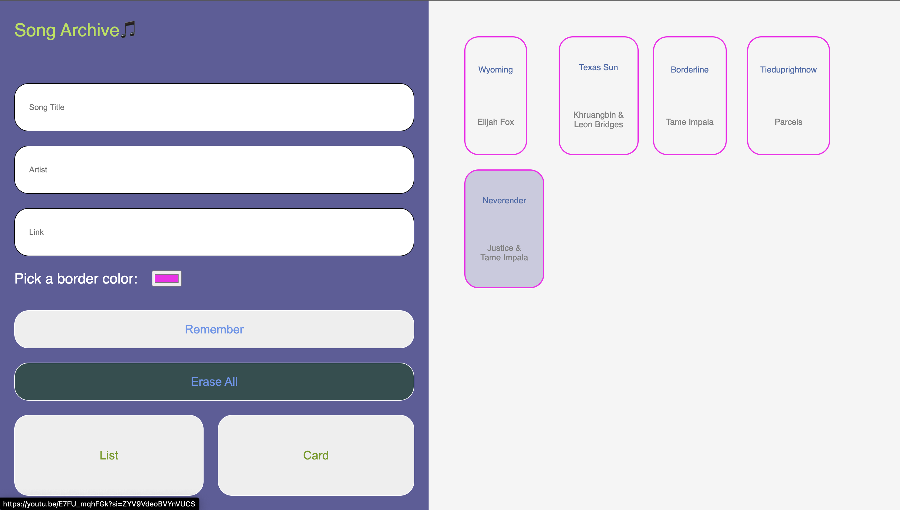

# Assignment 01 

## Brief

Starting from the concept of a pinboard, implement a web page that:

- is responsive (properly layout for smartphone, tablet, and desktop)
- allows the user to add and remove elements
- allows the user to coustomize elements (i.e. colors, size)
- allows the switch between two views (at least)

## Screenshots

## Project Description

This application is a dynamic digital pinboard for saving and organizing structured content. It was originally designed for archiving songs, artists and links but its flexible input fields make it useful for remembering any kind of content, link, or resource.

- Enter a Title, Artist (or any custom label), and a URL link. Click “Remember” to pin your entry.
- Each pinned item is a clickable hyperlink that opens in a new browser tab.
- The built-in color picker to personalizes each item’s appearance. 
- Allows the user to Toggle between List View and Card View
- The Erase All button clears your archive completely, giving the user a fresh start.
- The application is responsive, providing 2 different views for different devices.
