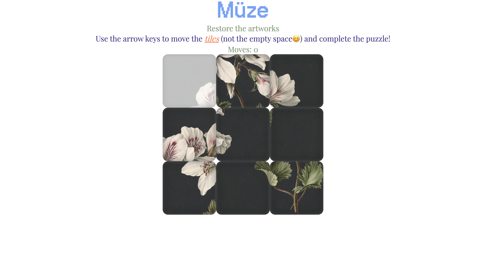

# Assignment 02 

## Brief

Choose a “mini-game” to rebuild with HTML, CSS and JavaScript. The requirements are:

- The webpage should be responsive
- Choose an avatar at the beginning of the game
- Keep track of the score of the player
- Use the keyboard to control the game (indicate what are the controls in the page). You can also use buttons (mouse), but also keyboard.
- Use some multimedia files (audio, video, …)
- Implement an “automatic restart” in the game (that is not done via the refresh of the page)

## Screenshots

## Project Description

Müze: Restore the artworks is a 3x3 sliding puzzle game. The goal is to restore the scrambled artwork by sliding the tiles back into their original positions. The game offers four different puzzles. By using arrow keys, the player moves tiles into the empty spot the restore the artwork. 

## Flowchart

## Functions

## document.addEventListener('keydown') 
Parameters: none

Returns: none 

This event listener handles keyboard input from the user.When an arrow key is pressed, the tile adjacent to the empty space in the direction of the key moves into the empty space. The empty tile does not move in the arrow’s direction;instead, the tile moves in the direction of the key, and the empty tile simply occupies the tile’s previous position. The function checks if movement in the pressed direction is possible using movementPossibilities[]. If the direction is valid, the movement is executed. 

## Arrow Keys
-ArrowLeft: The tile to the right of the empty tile moves left into the empty space. 

-ArrowRight: The tile to the left of the empty tile moves right into the empty space. 

-ArrowUp: The tile below the empty tile moves up into the empty space. 

-ArrowDown: The tile above the empty tile moves down into the empty space. If the move is valid, the function then: 
1. Swaps the tile and the empty space 
2. Updates the visual puzzle display 
3. Increments the move counter 
4. Checks if the puzzle is solved 

## setPuzzle(number) 
Parameters: 
* number (string), the puzzle id (“1”, “2”, “3”, or “4”). 
Return: none 
This function activates the selected puzzle by assigning the data-puzzle attribute to the puzzle container.The attribute dynamically changes the background images of all tiles via CSS. It also resets the move counter and triggers the initial drawing of the puzzle using updatePuzzle(). 

## swapTiles(prevPosition, updatedPosition) 
Parameters: 
* prevPosition (Number), Index of the empty tile ("P") 
* updatedPosition (Number), Index of the tile being moved into the empty space 
Return none 
This function physically swaps the two values inside userPuzzle[], which stores the current state of the puzzle.
After swapping: 
* It checks for a completed puzzle (checkWin()) 
* If the player wins:Displays a “you won” message and triggers a timeout to reload the game 
* Otherwise, play the tile movement sound 

## CheckWin() 
Parameters none
Return: 
* true if the tiles match correctPuzzle[] exactly 
* false otherwise 
This function compares the entire userPuzzle[] array to the reference array correctPuzzle[].If every tile matches the correct position, the player has restored the artwork. reload() Parameters noneReturn none Resets the game after the player wins. 

* Restores userPuzzle[] to the predetermined shuffled sequence 
* Clears the winning message 
* Shows the popup banner again 
* Allows the player to choose a new puzzle updatePuzzle() Parameters noneReturn none This function redraws the sliding puzzle on the page. For each tile: 
* It finds the corresponding DOM element by ID 
* Applies the class corresponding to the tile code 
* Plays the tile “snap” sound effect 
* Increments and updates the move counter displayed in the header

## reload()
Parameters none
Return none 
Resets the game after the player wins. 

-Restores userPuzzle[] to the predetermined shuffled sequence 

-Clears the winning message 

-Shows the popup banner again 

-Allows the player to choose a new puzzle 
 
## updatePuzzle() 
Parameters none
Return none This function redraws the sliding puzzle on the page. For each tile: 
* It finds the corresponding DOM element by id
* Applies the class corresponding to the tile code 
* Plays the tile “snap” sound effect 
* Increments and updates the move counter displayed in the header

