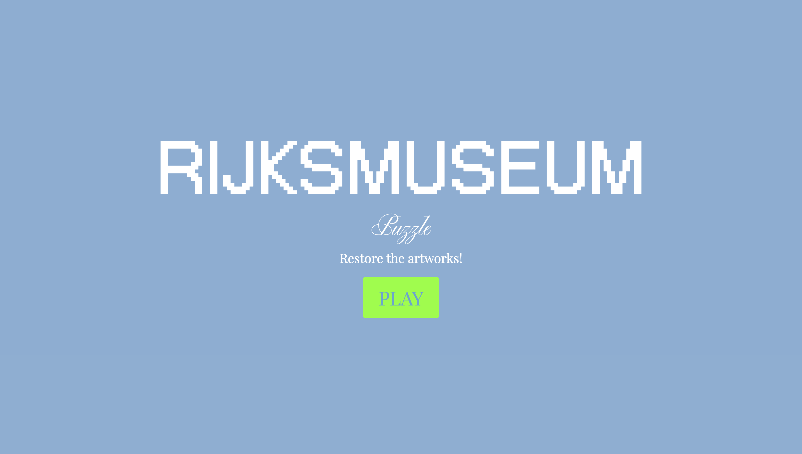
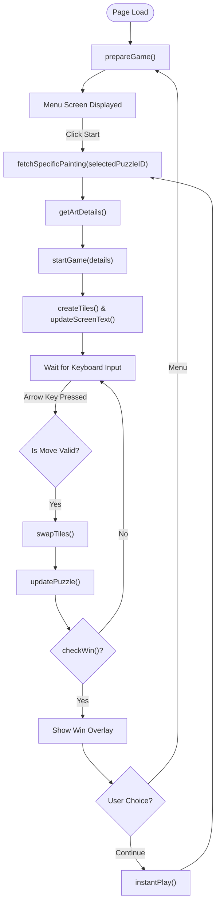

# Assignment 02 

## Brief

# Brief

Upgrade the **Assignment 02** by adding the use of data coming from an external web API. For example, fetch contents (audio, images, video, text, metadata) from online archives, AI generated contents (chatGPT API), data (weather, realtime traffic data, environmental data).

The application **must** have those requirements:

- The webpage is responsive
- Use a web API (you choose which one best fists for your project) to load the data and display them in the webpage
- At least one multimedia file (for user feedback interactions, or content itself)
- Develop a navigation system that allows the user to navigate different sections with related content and functionalities

## Screenshots

## Project Description

Rijksmuseum:restore the artworks is a 3×3 sliding-tile puzzle  using real paintings from the Rijksmuseum public API. When the game begins, one artwork is randomly selected and displayed. The painting is cut into 9 tiles: 8 visible pieces and 1 empty tile. The player must slide the tiles around using the arrow keys to reassemble the original artwork. The player can only move tiles that are adjacent to the empty space. Each valid move swaps the empty tile "P" with a neighboring tile, increasing the move counter. When all tiles match the correct order, the player has successfully restored the painting. After finishing a puzzle, players can either return to the menu or load and start a new artwork.

While solving the puzzle, the player is also presented with a small information card associated with the selected artwork. This card includes the painting’s title, creator, date, and a brief description, along with a reference thumbnail. The card is collapsible, so the details can be easily hidden to focus on gameplay. The proportions of the puzzle grid adapt to the dimensions of the artwork to ensure that the reconstructed image remains visually accurate.

## Flowchart

## Functions

## prepareGame()

* Fetches artworks from the API.

* Filters to keep only artworks with valid images and suitable aspect ratios.

* Saves them to paintingList and picks a random artwork ID for later use.

## instantPlay()

* Picks a random artwork from paintingList.

* Fetches its details and starts the puzzle immediately.

## fetchSpecificPainting(id)

* Takes an artwork ID

* Fetches full details from the API

* Sends the artwork details to startGame()

## getValidPaintings(paintingsList)

* Filters artworks to only include those with images and compatible aspect ratios.

## getArtDetails(art)

* Converts an artwork object into a simple details object with title, artist, image, description, date, and size.

## pickRandomPainting()

* Picks a random artwork ID from paintingList and stores it.

## startGame(details)

* takes artwork details

* resets puzzle and move counter

* updates the information card

* sets up the puzzle tiles

* shows the game screen

## updateScreenText(details)

* Displays the artwork info 

* Sets puzzle aspect ratio

## createTiles(imageUrl)

* Clears the puzzle container.

* Creates 9 li elements for the tiles.

* Sets their background image to the artwork URL.

* Appends them to the puzzle container.

## updatePuzzle()

* Loops through userPuzzle and updates the tile classes in the DOM.

* Increments moveCount and updates the display.

* Plays a tile move sound if it’s not the first move.

## swapTiles(prev, current)

* Swaps the tiles in userPuzzle.

* Calls checkWin() to see if the puzzle is solved.

* Shows the win overlay if the puzzle is complete.

## checkWin()

* Compares each tile in userPuzzle to correctPuzzle.

* Returns true if all tiles match, false otherwise.

## Keyboard Event Listener (keydown)
Moves the empty tile if the arrow key press is valid.

* Ignores input if the menu is visible or overlay is active.

* Determines the new position of "P" based on arrow key pressed.

* Checks if the move is allowed using movementPossibilities.

* Calls swapTiles() and updatePuzzle() if the move is valid.

## Button Event Listeners

* startBtn: Calls fetchSpecificPainting(selectedPuzzleID) to start the game.

* menuBtn: Shows the menu, hides overlay, and calls prepareGame().

* continueBtn: Hides overlay/menu and calls instantPlay().

* headerBackBtn: Returns to menu and calls prepareGame().